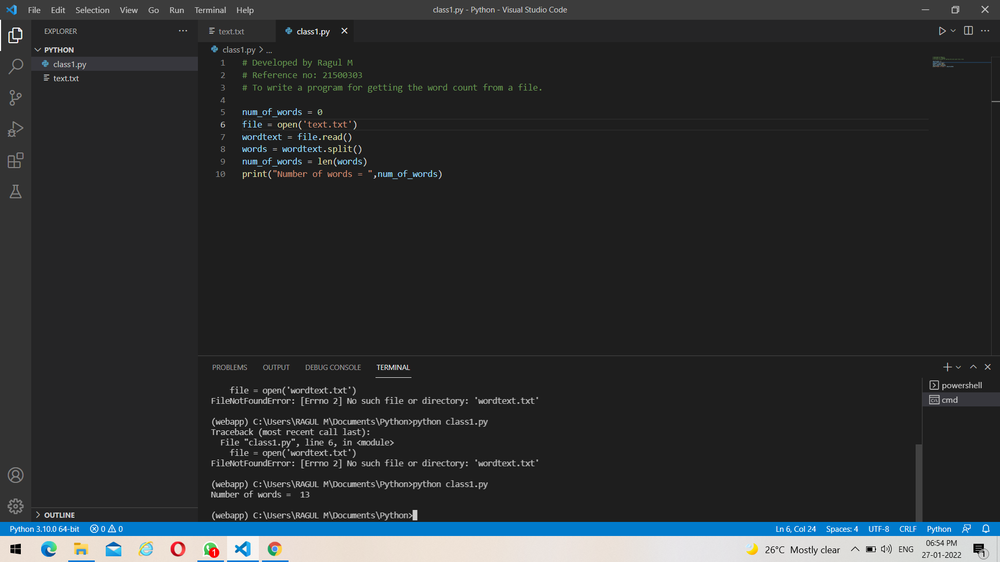
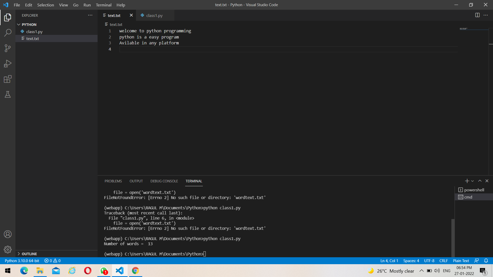

# Word-count
## AIM:
To write a python program for getting the word count from a file.
## EQUIPEMENT'S REQUIRED: 
PC
Anaconda - Python 3.7
## ALGORITHM: 
### Step 1:
Open visual Studio code,
### Step 2: 
Create a file with .py extension. 
### Step 3: 
Create a another file with .txt extension .
### Step 4:  
Enter some inputs (or) words in .txt file.
### Step 5: 
Enter the code with file name as excatly given in .txt extension.
### Step 6: 
Run the code to find out the number of words in the .txt file.
## PROGRAM:
~~~
# Developed by Ragul M
# Reference no: 21500303
# To write a program for getting the word count from a file.

num_of_words = 0
file = open('text.txt')
wordtext = file.read()
words = wordtext.split()
num_of_words = len(words)
print("Number of words = ",num_of_words)
~~~
### OUTPUT:

## RESULT:
Thus the program is written to find the word count from a file.
